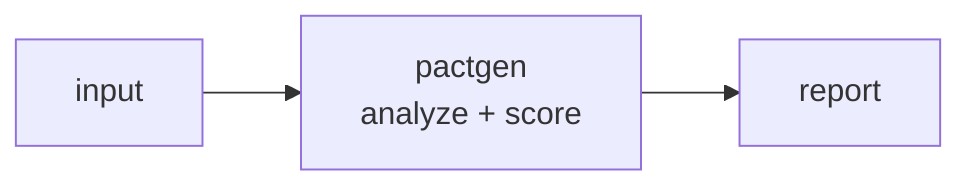

<a name="top"></a>
<div align="center">


# PACTGEN

### Generate branded sales proposals and SOWs from a YAML scope file + pricing table into PDF/HTML, with a deterministic line-item math check.


[](https://pypi.org/project/cognis-pactgen/) [](https://github.com/cognis-digital/pactgen/actions) [](LICENSE) [](https://github.com/cognis-digital)

*Part of the Cognis Neural Suite.*

</div>

```bash
pip install cognis-pactgen
pactgen build proposal.yaml -o proposal.html   # rendered doc + math check
pactgen build proposal.yaml --check            # CI gate: non-zero on bad math
```


<!-- cognis:example:start -->
## 🔎 Example output

Real, reproducible output from the tool — runs offline:

```console
$ pactgen-emit --version
pactgen 0.3.8
```

```console
$ pactgen-emit --help
usage: pactgen [-h] [--version] [--format {table,json,csv}] COMMAND ...

Generate proposals/SOWs from a YAML scope + pricing table to HTML, with line-item math checks.

positional arguments:
  COMMAND
    build               Parse a proposal spec, validate the math, and render
                        HTML.

options:
  -h, --help            show this help message and exit
  --version             show program's version number and exit
  --format {table,json,csv}
                        Output format for the summary/report: table (default),
                        json, or csv. Accepted before or after the subcommand.

Example: python -m pactgen build proposal.yaml -o out.html
```

> Blocks above are real `pactgen` output — reproduce them from a clone.

**Sample result format** _(illustrative values — run on your own data for real findings):_

```
{
    "pact": {
        "provider": "Example Inc.",
        "consumer": "PactGen",
        "version": "1.0"
    },
    "findings": [
        {
            "id": "1234567890",
            "title": "Suspicious Network Activity",
            "description": "Anomalous network traffic detected on port 443",
            "type": "indicator",
            "category": "network"
        }
    ]
}
```

<!-- cognis:example:end -->

## Usage — step by step

`pactgen` turns a YAML proposal/SOW spec into a rendered HTML document while
validating every line-item total. Console script: `pactgen` (or `python -m pactgen`).

1. **Install** (editable from a clone, or as a package):
   ```bash
   pip install -e .
   ```
2. **Build a proposal** — parse the spec, validate the math, and render HTML:
   ```bash
   pactgen build demos/01-basic/proposal.yaml -o proposal.html
   ```
3. **Gate the math only** (no HTML) — exits non-zero if any line-item total is wrong:
   ```bash
   pactgen build demos/01-basic/proposal.yaml --check
   ```
4. **Read the output** — use `--format json` for a machine-readable report you can pipe.
   `--format` is accepted **before or after** the `build` subcommand:
   ```bash
   pactgen build proposal.yaml --format json | jq '.totals.grand_total, .issues'
   pactgen --format json build proposal.yaml | jq '.ok'
   ```
   `issues` is empty when the math checks out; a non-empty list means a mismatch.
5. **Export to CSV** — drop line items + totals straight into a spreadsheet/ERP:
   ```bash
   pactgen build proposal.yaml --format csv -o bom.csv
   ```
6. **Automate in CI** — fail the build when totals don't reconcile:
   ```yaml
   # .github/workflows/proposals.yml
   - run: pip install -e .
   - run: for f in proposals/*.yaml; do pactgen build "$f" --check || exit 1; done
   ```

## Contents

- [Why pactgen?](#why) · [Features](#features) · [Quick start](#quick-start) · [Example](#example) · [Demos](#demos) · [Architecture](#architecture) · [AI stack](#ai-stack) · [How it compares](#how-it-compares) · [Integrations](#integrations) · [Install anywhere](#install-anywhere) · [Related](#related) · [Contributing](#contributing)

<a name="why"></a>
## Why pactgen?

Proposals diffable in git with reproducible builds — the same scope file always renders the same dollar total, so no more copy-paste pricing errors slipping to a client.

`pactgen` is single-purpose, scriptable, and self-hostable: feed it a YAML scope + pricing table, get the format your workflow already speaks (HTML · table · JSON · CSV), gate CI on the math, and let agents drive it over MCP.

<div align="right"><a href="#top">↑ back to top</a></div>

<a name="features"></a>
## Features

- ✅ Dependency-free YAML-subset parser (scalars, nested maps, lists of maps)
- ✅ Forgiving field aliases — `name`/`item`, `qty`/`quantity`, `unit_price`/`price`/`rate`
- ✅ Deterministic line-item + grand-total math check with cent tolerance
- ✅ Input validation — negative qty/price, discount out of 0..100, stated-total mismatch
- ✅ Self-contained HTML render (no external JS/CSS); `$`/`€`/`£` currency symbols
- ✅ Machine-readable **JSON** and spreadsheet-ready **CSV** exporters
- ✅ `--format` accepted before *or* after the subcommand
- ✅ CI gate: non-zero exit on any math/validation issue
- ✅ Runs on Linux/macOS/Windows · Docker · devcontainer
- ✅ Ports in Python, JavaScript, Go, and Rust (`ports/`)

<div align="right"><a href="#top">↑ back to top</a></div>

<a name="quick-start"></a>
## Quick start

```bash
pip install cognis-pactgen
pactgen --version
pactgen build demos/01-basic/proposal.yaml --check          # math gate (CI)
pactgen build demos/01-basic/proposal.yaml --format json    # machine-readable
pactgen build demos/01-basic/proposal.yaml --format csv     # spreadsheet/ERP
pactgen build demos/01-basic/proposal.yaml -o proposal.html # client-ready HTML
```

<div align="right"><a href="#top">↑ back to top</a></div>

<a name="example"></a>
## Example

```text
$ pactgen build demos/01-basic/proposal.yaml
Autonomous Trading Infrastructure — Statement of Work  (Greenway Engineering LLC -> Acme Robotics, Inc., 2026-06-08)
------------------------------------------------------------
Item                               Qty      Unit       Total
Backend engineering                 40    150.00     6000.00
Infrastructure / DevOps             20    200.00     4000.00
UX design                           16    125.00     2000.00
Project management                  30    200.00     6000.00
------------------------------------------------------------
                                        Subtotal    18000.00
                                        Discount    -1800.00
                                             Tax     1336.50
                                     TOTAL (USD)    17536.50

MATH CHECK FAILED (2 issue(s)):
  - UX design: Line total mismatch (qty 16.0 x 125.0) (expected 2000.00, found 2500.00)
  - grand_total: Stated grand total does not match computed total (expected 17536.50, found 18000.00)
```

<div align="right"><a href="#top">↑ back to top</a></div>

<a name="demos"></a>
## Demos — real-use-case scenarios

Each folder under [`demos/`](demos/) is a self-contained scenario: a real-format
`proposal.yaml` plus a `SCENARIO.md` with the story, the exact run command, and
the expected output. Run any of them straight from a clone.

| Demo | Scenario | Gate |
|---|---|:--:|
| [`01-basic`](demos/01-basic/) | Consulting SOW with a bad line total **and** a wrong grand total | ❌ fails |
| [`02-clean-saas-retainer`](demos/02-clean-saas-retainer/) | Monthly managed-SaaS retainer, 5% loyalty discount | ✅ passes |
| [`03-eur-fixed-bid`](demos/03-eur-fixed-bid/) | EUR fixed-bid web redesign with 19% VAT (`€` rendering) | ✅ passes |
| [`04-discount-rounding`](demos/04-discount-rounding/) | Fractional `.99`/`.50` pricing + volume discount, cent rounding | ✅ passes |
| [`05-sow-line-error`](demos/05-sow-line-error/) | T&M SOW with one fat-fingered line total | ❌ fails |
| [`06-field-aliases`](demos/06-field-aliases/) | `item`/`quantity`/`rate` aliases + nested vendor/client maps (GBP) | ✅ passes |
| [`07-invalid-inputs`](demos/07-invalid-inputs/) | Messy export: negative qty, discount > 100%, total mismatch | ❌ fails |
| [`08-csv-export`](demos/08-csv-export/) | Hardware + labor BOM exported to **CSV** for procurement | ✅ passes |
| [`09-ci-batch`](demos/09-ci-batch/) | Batch-gate a folder of proposals in CI (one member fails) | ❌ fails |

```bash
# Try the CSV exporter on the bill-of-materials demo:
pactgen build demos/08-csv-export/proposal.yaml --format csv

# Watch the gate catch a single bad line:
pactgen build demos/05-sow-line-error/proposal.yaml --check; echo "exit=$?"
```

<div align="right"><a href="#top">↑ back to top</a></div>

<a name="architecture"></a>
## Architecture



<div align="right"><a href="#top">↑ back to top</a></div>

<a name="ai-stack"></a>
## Use it from any AI stack

`pactgen` is interoperable with every popular way of using AI:

- **MCP server** — `pactgen mcp` (Claude Desktop, Cursor, Cognis.Studio, [uncensored-fleet](https://github.com/cognis-digital/uncensored-fleet))
- **OpenAI-compatible / JSON** — pipe `pactgen build proposal.yaml --format json` into any agent or LLM
- **LangChain · CrewAI · AutoGen · LlamaIndex** — wrap the CLI/JSON as a tool in one line
- **CI / scripts** — exit codes + JSON/CSV for non-AI pipelines

<div align="right"><a href="#top">↑ back to top</a></div>

<a name="how-it-compares"></a>
## How it compares

| | **Cognis pactgen** | Pandoc + Typst, echoing PandaDoc |
|---|:---:|:---:|
| Self-hostable, no account | ✅ | varies |
| Single command, zero config | ✅ | ⚠️ |
| JSON + CSV + math gate for CI | ✅ | varies |
| MCP-native (AI agents) | ✅ | ❌ |
| Polyglot ports (JS/Go/Rust) | ✅ | ❌ |
| Open license | ✅ COCL | varies |

*Built in the spirit of **Pandoc + Typst, echoing PandaDoc/Proposify**, re-framed the Cognis way. Missing a credit? Open a PR.*

<div align="right"><a href="#top">↑ back to top</a></div>

<a name="integrations"></a>
## Integrations

Pipes into your stack: **JSON** for anything, **CSV** for spreadsheets/ERP, an **MCP server** (`pactgen mcp`) for AI agents, and `pactgen-emit` to forward results via cognis-connect (Slack/webhook/brief). See [`docs/INTEGRATIONS.md`](docs/INTEGRATIONS.md).

<div align="right"><a href="#top">↑ back to top</a></div>

<a name="install-anywhere"></a>
## Install — every way, every platform

```bash
pip install "git+https://github.com/cognis-digital/pactgen.git"    # pip (works today)
pipx install "git+https://github.com/cognis-digital/pactgen.git"   # isolated CLI
uv tool install "git+https://github.com/cognis-digital/pactgen.git" # uv
pip install cognis-pactgen                                          # PyPI (when published)
docker run --rm ghcr.io/cognis-digital/pactgen:latest --help        # Docker
brew install cognis-digital/tap/pactgen                             # Homebrew tap
curl -fsSL https://raw.githubusercontent.com/cognis-digital/pactgen/main/install.sh | sh
```

| Linux | macOS | Windows | Docker | Cloud |
|---|---|---|---|---|
| `scripts/setup-linux.sh` | `scripts/setup-macos.sh` | `scripts/setup-windows.ps1` | `docker run ghcr.io/cognis-digital/pactgen` | [DEPLOY.md](docs/DEPLOY.md) (AWS/Azure/GCP/k8s) |

<div align="right"><a href="#top">↑ back to top</a></div>

<a name="related"></a>
## Related Cognis tools

- [`warmline`](https://github.com/cognis-digital/warmline) — Score and rank inbound/outbound leads from a YAML rulebook, emitting a ranked queue as JSON/CSV for your SDRs and CI gates.
- [`coldforge`](https://github.com/cognis-digital/coldforge) — Render personalized cold-outreach sequences from Markdown templates + a contacts CSV, with spam-score linting and per-send dry-run preview.
- [`crmsync`](https://github.com/cognis-digital/crmsync) — Bidirectional, idempotent sync of contacts/deals between a local SQLite source-of-truth and CRM APIs (HubSpot/Pipedrive/Salesforce) via one config.
- [`dripcheck`](https://github.com/cognis-digital/dripcheck) — Lint email sequences and drip campaigns for deliverability: SPF/DKIM/DMARC, link health, unsubscribe presence, and CAN-SPAM/GDPR compliance.
- [`dealflow`](https://github.com/cognis-digital/dealflow) — Model your sales pipeline as a YAML state machine and compute conversion rates, stage velocity, and weighted forecast straight from CRM exports.
- [`introbot`](https://github.com/cognis-digital/introbot) — Find warm-intro paths through your team's combined network graph and draft double-opt-in intro requests from a single contacts manifest.

**Explore the suite →** [🗂️ all 170+ tools](https://github.com/cognis-digital/cognis-neural-suite) · [⭐ awesome-cognis](https://github.com/cognis-digital/awesome-cognis) · [🔗 cognis-sources](https://github.com/cognis-digital/cognis-sources) · [🤖 uncensored-fleet](https://github.com/cognis-digital/uncensored-fleet) · [🧠 engram](https://github.com/cognis-digital/engram)

<div align="right"><a href="#top">↑ back to top</a></div>

<a name="contributing"></a>
## Contributing

PRs, new rules, and demo scenarios are welcome under the collaboration-pull model — see [CONTRIBUTING.md](CONTRIBUTING.md) and [SECURITY.md](SECURITY.md).

> ### ⭐ If `pactgen` saved you time, **star it** — it genuinely helps others find it.

## Interoperability

`{}` composes with the 300+ tool Cognis suite — JSON in/out and a shared
OpenAI-compatible `/v1` backbone. See **[INTEROP.md](INTEROP.md)** for the
suite map, composition patterns, and reference stacks.

## License

Source-available under the **Cognis Open Collaboration License (COCL) v1.0** — free for personal, internal-evaluation, research, and educational use; **commercial / production use requires a license** (licensing@cognis.digital). See [LICENSE](LICENSE).

---

<div align="center"><sub><b><a href="https://cognis.digital">Cognis Digital</a></b> · one of 170+ tools in the <a href="https://github.com/cognis-digital/cognis-neural-suite">Cognis Neural Suite</a> · <i>Making Tomorrow Better Today</i></sub></div>
